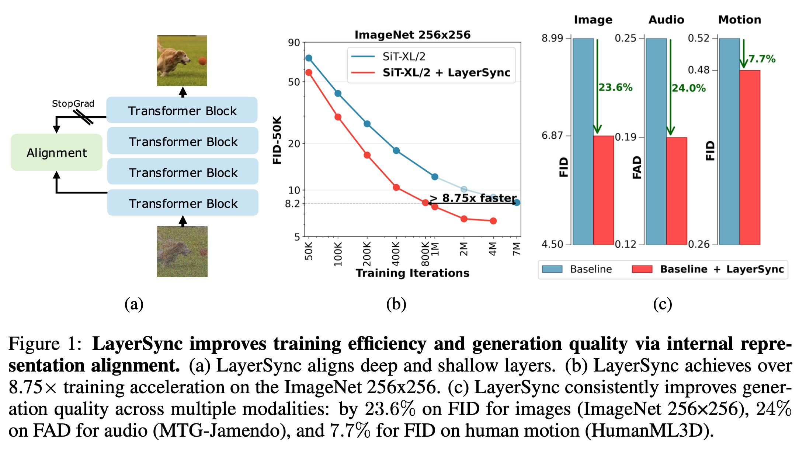
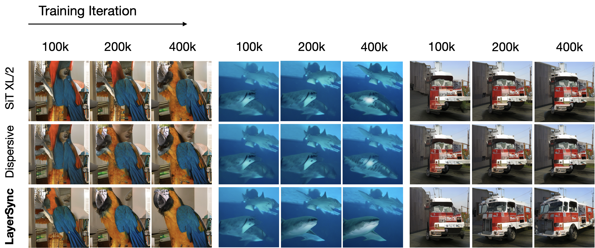

# 💠 LayerSync: Self-aligning Intermediate Layers

Yasaman Haghighi\*, Bastien van Delft\*, Mariam Hassan, Alexandre Alahi
 
École Polytechnique Fédérale de Lausanne (EPFL)

<p align="center">
  <a href="https://arxiv.org/abs/2510.12581"><b>📄 Paper</b></a> •
  <a href="https://vita-epfl.github.io/LayerSync.io/"><b>🌐 Website</b></a>
</p>

---

> 🧠 **Abstract:**
> We propose LayerSync, a domain-agnostic approach for improving the generation quality and the training efficiency of diffusion models. Prior studies have highlighted the connection between the quality of generation and the representations learned by diffusion models, showing that external guidance on model intermediate representations accelerates training. We reconceptualize this paradigm by regularizing diffusion models with their own intermediate representations. Building on the observation that representation quality varies across diffusion model layers, we show that the most semantically rich representations can act as an intrinsic guidance for weaker ones, reducing the need for external supervision. Our approach, LayerSync, is a self-sufficient, plug-and-play regularizer term with no overhead on diffusion model training and generalizes beyond the visual domain to other modalities. LayerSync requires no pretrained models nor additional data. We extensively evaluate the method on image generation and demonstrate its applicability to other domains such as audio, video, and human motion generation. LayerSync consistently enhances the generation quality and the training efficiency. For example, it speeds up the training of flow-based transformer by over 8.75x on the ImageNet dataset and improves the generation quality by 23.6\%. 

---

<p align="center">
  
</p>

<p align="center">
  
</p>

---

## 🛠️ Setup

First, clone and set up the repository:

```bash
git clone https://github.com/vita-epfl/LayerSync.git
cd LayerSync
```

We provide an `environment.yml` file that can be used to create a Conda environment.
If you only want to run pre-trained model locally on CPU, you can remove the `cudatoolkit` and `pytorch-cuda` requirements from the file.

```bash
conda env create -f environment.yml
conda activate LayerSync
```

---

## 📦 Dataset

We use the **ImageNet-1K** dataset.
Please first **register on [Hugging Face](https://huggingface.co/)**, agree to the dataset’s terms and conditions, and then download:

👉 [ImageNet-1K Dataset](https://huggingface.co/datasets/ILSVRC/imagenet-1k)

---

## 🚀 Training with LayerSync

To train with LayerSync, run:

```bash
torchrun --nnodes=1 --nproc_per_node=N train.py \
  --model SiT-XL/2 \
  --loss-type "layer_sync" \
  --reg-weight 0.2 \
  --encoder-depth 8 \
  --gt-encoder-depth 16
```

---

## 🧩 Evaluation

You can generate images (and the resulting `.npz` file can be used for ADM evaluation suite) using:

```bash
torchrun --nnodes=1 --nproc_per_node=N sample_ddp.py ODE \
  --model SiT-XL/2 \
  --num-fid-samples 50000
```

---

## 🔗 Using LayerSync in a New Project

To use LayerSync in your own project, follow this reference line and synchronize two layers:

🔍 [LayerSync Code Reference](https://github.com/vita-epfl/LayerSync/blob/2321e0273f7a03588e6e30b553f199333be1e7a9/transport/transport.py#L167)

---

## 🧭 To-Do
* [ ] Release checkpoints
* [ ] Add audio scripts
* [ ] Add representation evaluation scripts

---

## 🙏 Acknowledgement

We greatly appreciate the tremendous effort behind the following fantastic projects:

* [**SiT**](https://github.com/willisma/SiT)
* [**REPA**](https://github.com/sihyun-yu/REPA.git) 

This codebase is primarily built upon **SiT** and **REPA** repositories.

---

## 📚 Citation

If you find our work or code useful, please cite:

```bibtex
@misc{haghighi2025layersyncselfaligningintermediatelayers,
      title={LayerSync: Self-aligning Intermediate Layers}, 
      author={Yasaman Haghighi and Bastien van Delft and Mariam Hassan and Alexandre Alahi},
      year={2025},
      eprint={2510.12581},
      archivePrefix={arXiv},
      primaryClass={cs.CV},
      url={https://arxiv.org/abs/2510.12581}, 
}
```
